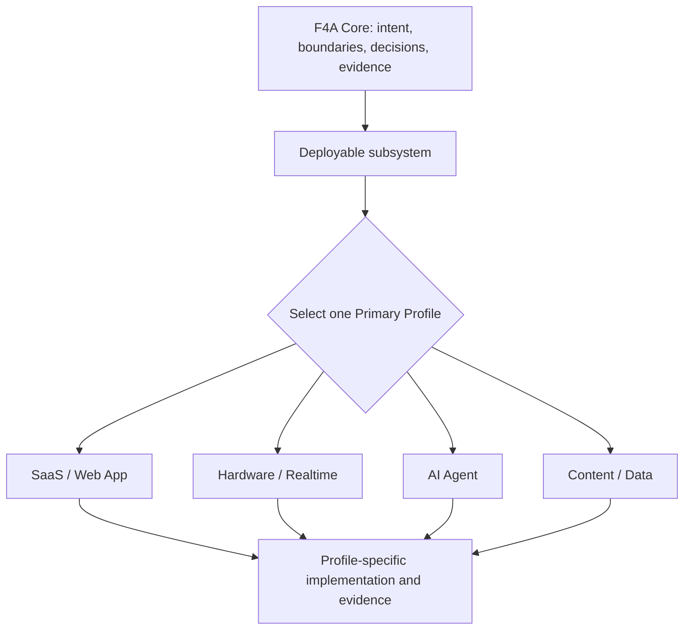

# F4A Architecture Map

## Governance and runtime relationship

## Subsystem inventory

| Subsystem | Deployment boundary | Primary Profile | Risk | External dependencies | Owner |
| --- | --- | --- | --- | --- | --- |
| [example-api] | [cloud service] | SaaS | High | DB, payment | [owner] |

## Contract map

For each connection between subsystems, record protocol, schema/version, authentication, timeout, retry/idempotency, failure behavior, and ownership.

## Rule

Profiles apply to deployable subsystems, not blindly to the repository root. Shared libraries must declare who owns their contracts and which subsystem may depend on them.
